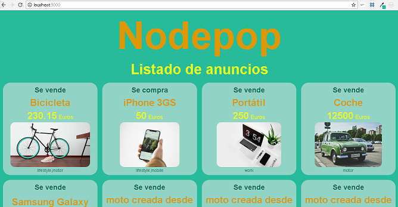

<p align=center></p>


Nodepop is a web-API made with Nodejs and Express to buy anda sell second-hand items.

This is a project of the Web Development Bootcamp of Keepcoding.

## Despligue práctica DevOps

La aplicación nodepop ha sido desplegueada usando un servidor en AWS con NGNIX y PM2.

[http://ec2-3-90-181-23.compute-1.amazonaws.com/](http://ec2-3-90-181-23.compute-1.amazonaws.com/)


Para la página estática he usado la web de la práctica de Fundamentos de FrontEnd en lugar de una plantilla HTML.

[http://3.90.181.23/](http://3.90.181.23/)


## Instalation

```shell
npm install
```
Copy .env.example to .env and review values

## Database

This API has been made using Mongoose and MongoDB.

To initialize the database use:
```shell
npm run install_db
```

By doing this you delete all the items you had in your database (in case you had any) and initialize the database with 5 new items and 1 user for the API.

You can check the JSON used to initialize the database in *./data/adds.json*

Theres is an schema created for each add:
```js
const addSchema = mongoose.Schema({
    name: String,
    toSell: Boolean,
    price: Number,
    picture: String,
    tags: [String] 
});
```
You must follow this schema to create new adds.

## Run

To start the application in production use:

```shell
npm start
```

## Development

To start the application in development use:

```shell
npm run dev
```
### **Authentication**

To access API data authentication is required. The API use JWT to authenticate.

 Once you initialize the data base  you can use these default user credentials:

 ```
 email: user@example.com
 password: 1234
 ```

 to authenticate use POST method in the route:

 ```
 /apiv1/authenticate
 ```

This will return a **token** you will have to use when you make a call to the API. You can use it in the query string as follows:
```
/apiv1/authenticate/?token=<generatedtoken>
```
The token expires in two days.

### **Thumbnail microservice**

To create a Thumbnail of every image you upload when creating a new add, you must run the microservice "thumbnailService.js".

To run thumbnailService.js:
```
npm run thumbnailService
```
## Tests

To run tests enter:
```
npm test
```

## Guide of use
Nodepop is an API that provides a list of second-hand items. The API supports the following operations:

- Paginated adds list (*skip, limit, sort*) and filter (by *name*, *tags*, *price* and *toSell* ).
- List of existing tags.
- Create new adds.


### **Applying filters**

To aplly filters by *price range* you need to consider the following rules:
- 10-50 :  Use the "**-**" to specify a **range** between two values.
- 50 : If you write just a value, it will return all the adds that **matches** that value.
- 50- :Use "**-**" after the value to look fot the adds that are **equal or greater** than that value.
- -50 : Use "**-**" after the value to look fot the adds that are **equal or less** than that value.

To get a list of all existing tag you must pass the word "**tags**" as a param in the URL and it will return the current list of tags.

The toSell property is a boolean so you have to write *true* to see the selling items, and *false* to see the buying items.


### **Creating new adds**

When creating a new add using the *POST* method (in Postman, for instance) you can upload an image which will be saved in the "uploads" folder, inside of ./public/images.


### **Web Client**

There is and index.html view from which you can view the list of adds and apply the same filters and paginated list than in the API. You can also get the list of tags by writing  */tags* in the URL.

This is an example of the index.html view:

<p align=center></p>
   

